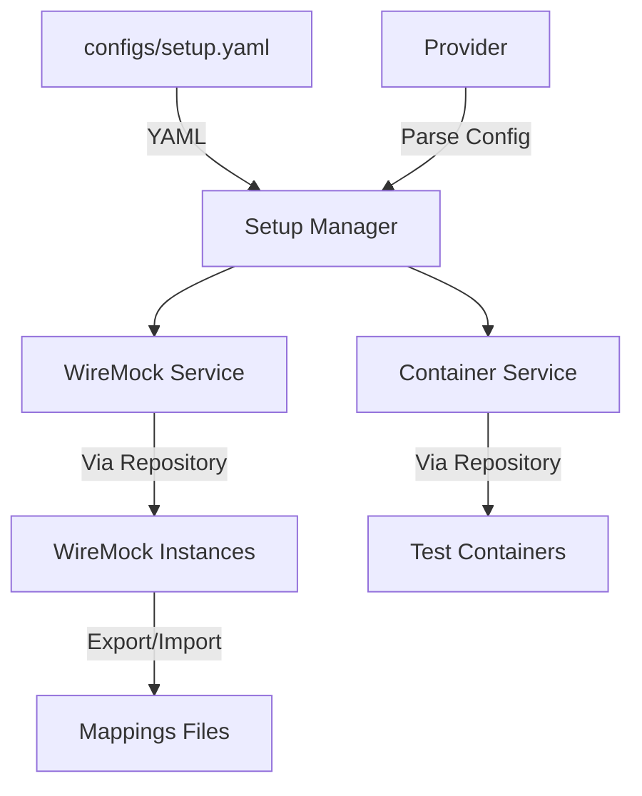
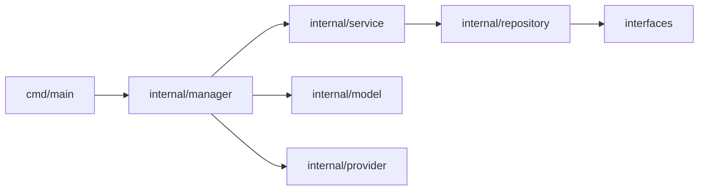

# Dependency Mock Generator

A Go library for managing WireMock instances and containerized dependencies using test containers. This library simplifies the process of setting up mock services and dependencies for testing environments.

## Features

- 🎭 WireMock management for API mocking
- 🐳 Container-based dependency management using testcontainers-go
- 📝 YAML-based configuration
- 🔄 Import/Export mock states
- 🧪 Built-in testing support

## Installation

```bash
go get github.com/rieshbissessur/dependency-mock-generator
```

Ensure you have Docker installed and running for container-based features.

## Architecture



## Configuration

Create a `setup.yaml` file to configure your mocks and containers:

```yaml
Containers:
  #- Name: redis    # Example container configuration
  #  Image: redis
  #  Tag: latest
  #  Port: 6379

Mocks:
  - Name: Mock     # WireMock service
    Type: 0        # 0 = WireMock type
    File: ""       # Optional: Path to mappings file
```

## Usage

### Basic Setup

```go
package main

import (
    "fmt"
    "github.com/rieshbissessur/dependency-mock-generator/internal/manager"
)

func main() {
    err := manager.RunSetup("configs/setup.yaml")
    if err != nil {
        fmt.Println("Error with setup:", err)
        return
    }

    // Your application code here...
}
```

### Working with WireMock

```go
// Import mock state from a file
err := manager.ImportMockStateFromFile("mappings/Mock-2025-05-26T15:50:31+02:00.json")
if err != nil {
    fmt.Println("Error importing mock state:", err)
    return
}

// Access active mocks
value, exists := manager.ActiveMocks["Mock"]
if exists {
    fmt.Printf("Mock is running at: %s\n", value)
}
```

### Testing Example

```go
func TestWithRedis(t *testing.T) {
    ctx := context.Background()
    req := testcontainers.ContainerRequest{
        Image:        "redis:latest",
        ExposedPorts: []string{"6379/tcp"},
        WaitingFor:   wait.ForLog("Ready to accept connections"),
    }

    redisC, err := testcontainers.GenericContainer(ctx, testcontainers.GenericContainerRequest{
        ContainerRequest: req,
        Started:         true,
    })
    require.NoError(t, err)
    defer redisC.Terminate(ctx)

    // Your test code here...
}
```

## Project Structure



Components:
- `cmd/`: Entry points and CLI commands
- `configs/`: YAML configuration files
- `internal/`:
  - `manager/`: Core setup and mock management
  - `service/`: Business logic for containers and WireMock
  - `repository/`: Data access layer
  - `model/`: Data structures
  - `provider/`: Configuration providers
- `test/`: Test files and mocks
- `mappings/`: WireMock mapping files

## Dependencies

- [testcontainers-go](https://github.com/testcontainers/testcontainers-go): For managing containerized dependencies
- [go-wiremock](https://github.com/wiremock/go-wiremock): For WireMock integration
- [yaml.v3](https://github.com/go-yaml/yaml): For configuration parsing
- [testify](https://github.com/stretchr/testify): For testing utilities

## Development

### Prerequisites

- Go 1.20 or higher
- Docker
- IDE with Go support (e.g., VSCode with Go extension)

### Running Tests

```bash
go test ./... -v
```

### Building

```bash
go build -o bin/github.com/rieshbissessur/dependency-mock-generator
```

## Contributing

1. Fork the repository
2. Create a feature branch
3. Commit your changes
4. Push to the branch
5. Create a Pull Request

## License

[MIT License](LICENSE)
